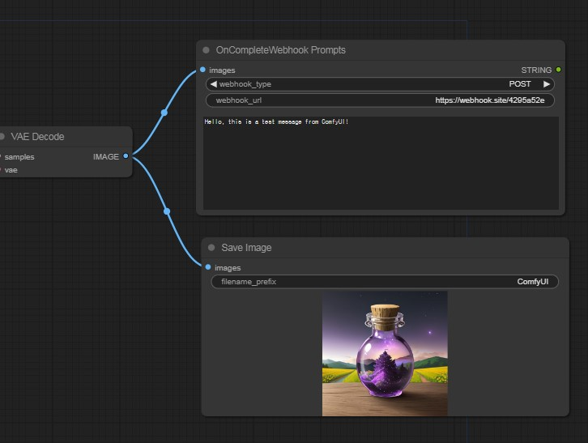

# Comfy-UI on-complete-email-me

[한국어](./README_kr.md) | [English](/)
---

A feature that sends an email via Gmail once image generation is completed in Comfy-ui.

## Table of Contents
- [Installation](#installation)
- [Usage](#usage)
- [License](#license)

## Installation

1. Copy the Git URL

2. Click on Comfy-UI-Manager
3. Click Install via GIT URL

4. Paste the Git URL
5. Restart Comfy-UI

## Usage

1. Enter your Gmail email address in `sender_email`.
2. Generate and enter your Gmail app password in `sender_password` (do not enter your Gmail account password).
   - Link for creating app password: [Google App Passwords](https://myaccount.google.com/apppasswords)
3. Enter the list of recipient email addresses (separated by Enter key).
4. Enter the message to be sent.

**OnCompleteWebhook Node**
We have added a new node called OnCompleteWebhook. This node allows you to send a webhook notification upon the completion of a certain task or event.

**Usage**
Create the OnCompleteWebhook Node:

Follow the instructions to create the OnCompleteWebhook node in your workflow.
Configure the Webhook URL:

Set the webhook URL to the endpoint where you want to receive the notification.
Trigger the Node:

Ensure the node is triggered upon the completion of the desired task or event.
By using the OnCompleteWebhook node, you can integrate with external services and get notified about the completion of various processes.

Please update your workflows and check out the new functionality.

## License

This project is licensed under the GPL-3.0 License. See the LICENSE file for details.

