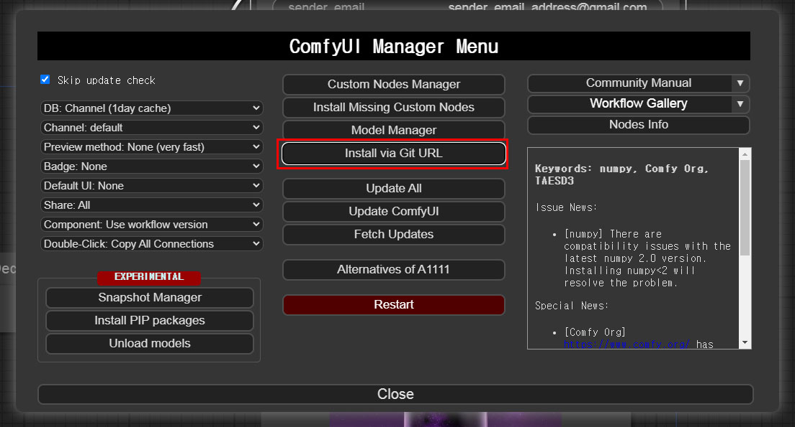
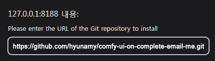
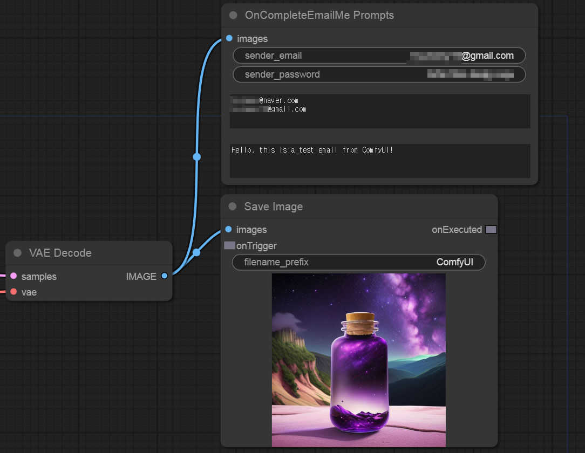

# Comfy-UI on-complete-email-me

[English](/) | [한국어](./README_kr.md)
---

Comfy-ui 에서 이미지 생성이 완료되면 Gmail로 이메일을 발송하는 기능입니다.

## 목차
- [설치](#설치)
- [사용법](#사용법)
- [라이선스](#라이선스)

## 설치

1. Git 주소 복사

2. Comfy-UI-Manager 클릭
3. Install via GIT URL 클릭

4. Git 주소 붙여넣기
5. Comfy-UI 재시작

## 사용법

1. `sender_email`에 자신의 Gmail 이메일 주소를 입력합니다.
2. `sender_password`에 Gmail 앱 비밀번호를 생성하여 입력합니다 (Gmail 계정 비밀번호를 입력하지 마세요).
   - 앱 비밀번호 생성 방법 링크: [Google 앱 비밀번호](https://myaccount.google.com/apppasswords)
3. 이메일 받을 주소 목록을 입력합니다 (엔터로 구분).
4. 전달받을 메세지를 입력합니다.

## 라이선스

이 프로젝트는 MIT 라이선스에 따라 라이선스가 부여됩니다. 자세한 내용은 LICENSE 파일을 참조하세요.
